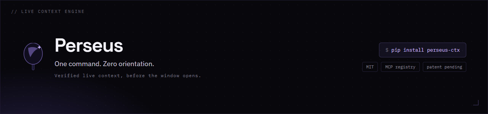

<div align="center">
  
</div>

# Perseus™ 🪞 — One command. Zero orientation.

[](https://smithery.ai/servers/Perseus-Computing-LLC/perseus)
**`pip install perseus-ctx && cd your-project && perseus quickstart`**

Zero to rendered context in three lines — no config spelunking:

```bash
pip install perseus-ctx                       # 1. install
cd your-project && perseus quickstart         # 2. scaffold .perseus/context.md + config
perseus render .perseus/context.md -o AGENTS.md   # 3. write live context your agent reads
```

`quickstart` detects your stack, scaffolds `.perseus/context.md`, writes config,
and verifies a render. Step 3 writes the file your assistant loads at session
start (`AGENTS.md`, `CLAUDE.md`, `.cursorrules`, ...). Keep it live with
`perseus watch` (or cron/systemd/launchd). Full walkthrough:
[QUICKSTART.md](./QUICKSTART.md).


[](https://github.com/Perseus-Computing-LLC/perseus/actions/workflows/test.yml)
[](https://pypi.org/project/perseus-ctx/)
[](https://registry.modelcontextprotocol.io/)
[](./LICENSE)
[](./docs/ip/README.md)
[**perseus.observer →**](https://perseus.observer)

**Perseus: the memory & context layer for AI agents. Load only the context they actually need.**

Your agents re-read their whole notebook from page one on every call, and you're billed per word. Perseus hands them just the page they need: it resolves live workspace state into verified facts before the context window opens, and pairs with [Perseus Vault](https://github.com/Perseus-Computing-LLC/perseus-vault) for durable, encrypted memory. The result: **73.8% on LongMemEval** (official harness), a **67% smaller tool schema**, and **611× warmer renders**. Local-first, air-gap ready, MIT.

<!-- mcp-name: io.github.Perseus-Computing-LLC/perseus -->

---

## 🛡️ Product Family

Perseus is the live context engine. Seven specialized products extend it:

| Product | Description | Page |
|---|---|---|
| **Perseus Vault** | 55+ MCP tools (exposed under 3 name aliases: `perseus_vault_*`/`mimir_*`/`mneme_*`) — persistent memory with FTS5, entities, layers, confidence decay | [/perseus-vault/](https://perseus.observer/perseus-vault/) |
| **MCTS** | 31 security analyzers for MCP servers — tool poisoning, prompt injection, credential leaks | [/mcts/](https://perseus.observer/mcts/) |
| **PR Pilot** | 5-agent autonomous PR review pipeline — graduated autonomy L1→L3 | [/pr-pilot/](https://perseus.observer/pr-pilot/) |
| **Blast Radius** | GitLab-native dependency impact analysis — 1 mention, instant risk report | [/blast-radius/](https://perseus.observer/blast-radius/) |
| **Rapid Agent** | Dual-backend memory agent (Elastic ↔ Engram-rs) — Google Cloud Hackathon | [/rapid-agent/](https://perseus.observer/rapid-agent/) |
| **Qwen Memory** | Agent that gets smarter every session — Qwen Cloud Hackathon | [/qwen-memory/](https://perseus.observer/qwen-memory/) |
| **CrewAI Memory** | Persistent cross-session memory backend for CrewAI (54K stars) — community PR #6208 | [/crewai/](https://perseus.observer/crewai/) |

---

### Perseus Vault — Persistent Memory (MCP)

[Perseus Vault](https://github.com/Perseus-Computing-LLC/perseus-vault) is the persistent memory backend for Perseus — a lightweight Rust MCP server with SQLite + FTS5. Zero network calls, no API keys. Offline dense/hybrid embeddings are **bundled by default** (the model is compiled into the binary), so semantic recall works zero-config with no external model download. Perseus Vault exposes **55+ MCP tools** (each also exposed under `perseus_vault_*`, `mimir_*`, and `mneme_*` aliases) across structured entities, hybrid vector search, RAG, connectors, confidence decay, journal events, and state management: `perseus_vault_remember`, `perseus_vault_recall`, `perseus_vault_context`, `perseus_vault_traverse`, `perseus_vault_decay`, `perseus_vault_stats`, `perseus_vault_health`, and more.

📄 [Product page →](https://perseus.observer/perseus-vault/) | ⭐ [GitHub →](https://github.com/Perseus-Computing-LLC/perseus-vault)

**Install** (prebuilt binary — Linux / macOS):
```bash
curl -sSf https://raw.githubusercontent.com/Perseus-Computing-LLC/perseus-vault/main/scripts/install.sh | sh
```
Windows / Intel-macOS (build from source): `cargo install --git https://github.com/Perseus-Computing-LLC/perseus-vault`. Then run `perseus doctor` to confirm Perseus can reach it.

**Hermes Agent** — add to `~/.hermes/config.yaml`:
```yaml
mcp_servers:
  perseus_vault:
    command: "perseus-vault"
    args: ["serve"]
```

**Claude Desktop / Cursor** — add to your MCP settings:
```json
{
  "mcpServers": {
    "perseus_vault": {
      "command": "perseus-vault",
      "args": ["serve"]
    }
  }
}
```

**Perseus integration** — add to `.perseus/config.yaml`:
```yaml
perseus_vault:
  enabled: true
  command: ["perseus-vault", "serve"]
```
The `perseus-vault` binary self-resolves its canonical default DB path, so no `--db` argument is needed (its default is `~/.mimir/data/perseus-vault.db`). The legacy `mimir:` key is still accepted for back-compat, so existing configs keep working. Then add `@memory mode=search query="your terms"` to `.perseus/context.md` and Perseus resolves live recall at render time.

Works with any MCP-compatible assistant.

## 🏆 Hackathons — 3 Entries Submitted

### Google Cloud Rapid Agent (Elastic Partner Track)
**Status:** Submitted | **Deadline:** June 11, 2026 | **Devpost:** [perseus-cmzeu9](https://devpost.com/software/perseus-cmzeu9)
📄 [Product page →](https://perseus.observer/rapid-agent/)

Perseus is entered in the Google Cloud Rapid Agent Hackathon (Elastic Partner Track).
The submission demonstrates persistent agent memory across three consecutive sessions,
with live backend swap from Elastic Cloud to Engram-rs (self-hosted).

### Qwen Cloud Hackathon (MemoryAgent Track)
**Status:** Submitted | 📄 [Product page →](https://perseus.observer/qwen-memory/)

Agent that gets smarter every session. Persistent memory, confidence decay, cross-session compounding. Track requirements checklist with contradiction demo beat.

### GitLab Transcend Hackathon (Showcase Track)
**Status:** Submitted | 📄 [Product page →](https://perseus.observer/blast-radius/)

Blast Radius — GitLab-native dependency impact analysis via Orbit knowledge graph. One @mention, instant risk report.

### Build with Gemini XPRIZE
**Status:** Submitted | 📄 [Product page →](https://perseus.observer/pr-pilot/)

PR Pilot — 5-agent autonomous PR review pipeline. Gemini API, Google Cloud Run, Stripe integration.

## Wire Perseus to Your Assistant (MCP)

Perseus implements the [Model Context Protocol](https://modelcontextprotocol.io/) (MCP), exposing tools over stdio or SSE transport. Every tool resolves live workspace state at invocation time — no stale cache, no pre-computed snapshots.

> **⚠️ Security Gate:** Shell-executing directives (`@query`, `@agent`, `@services command:`) require `export PERSEUS_ALLOW_DANGEROUS=1`. Without it, shell directives are silently skipped.

### Quick Start (MCP Server)

```bash
pip install perseus-ctx
perseus mcp serve                          # stdio (Claude Desktop, Claude Code, Cursor, Codex)
perseus mcp serve --transport sse --port 8420  # SSE (remote agents, multi-machine)
```

### Assistant-Specific Wiring

Pick your assistant and add the config block shown:

**Hermes Agent** (`~/.hermes/config.yaml`):

```yaml
mcp_servers:
  perseus:
    command: perseus
    args: ["mcp", "serve", "--workspace", "/path/to/workspace"]
```

Then verify with `hermes mcp test perseus`. Tools appear as `mcp_perseus_*` in your session.

> Use an absolute path for `--workspace`. Perseus's non-interactive shell context has a limited PATH — a bare `perseus` command works in the Hermes MCP config because Hermes resolves it from the user's environment, but the workspace path must be absolute.

**Claude Desktop** (`claude_desktop_config.json`):

```json
{
  "mcpServers": {
    "perseus": {
      "command": "perseus",
      "args": ["mcp", "serve", "--workspace", "/path/to/workspace"]
    }
  }
}
```

**Claude Code** (`.mcp.json` in your project root):

```json
{
  "mcpServers": {
    "perseus": {
      "command": "perseus",
      "args": ["mcp", "serve"]
    }
  }
}
```

**Cursor** (`.cursor/mcp.json`):

```json
{
  "mcpServers": {
    "perseus": {
      "command": "perseus",
      "args": ["mcp", "serve"]
    }
  }
}
```

**Codex** (`~/.codex/config.toml` or per-project `.mcp.json`):

```json
{
  "mcpServers": {
    "perseus": {
      "command": "perseus",
      "args": ["mcp", "serve"]
    }
  }
}
```

**Rovo Dev** (`.mcp.json` in repo root):

```json
{
  "mcpServers": {
    "perseus": {
      "command": "perseus",
      "args": ["mcp", "serve"]
    }
  }
}
```

Rovo Dev also reads `AGENTS.md` at session start — pair MCP tools with rendered context for a complete setup.

### Docker

```bash
docker build -t perseus .
docker run --rm -v /path/to/workspace:/workspace perseus mcp serve
```

See [Container Runtime](./docs/CONTAINER.md) for full Docker and compose deployment.

### MCP Registry

Published as [`io.github.Perseus-Computing-LLC/perseus`](https://registry.modelcontextprotocol.io/) on the official MCP Registry (search \"perseus\"). Includes `server.json` for zero-config discovery.

---

### MCP Tools

<!-- test-count: 1734 — recount with: grep -rE "^\s*def test_" tests/ | wc -l -->
<!-- The table below is the exact default output of _get_all_mcp_tools({}) — 33 rows. Recount before editing. -->
33 MCP tools resolve live state at invocation time (including the legacy aliases `perseus_get_context`/`perseus_get_health`). Two additional sensitive tools — `perseus_query` (run a shell command) and `perseus_agent` (execute a local agent subprocess) — are **not** part of this default set: they require explicit `mcp.tool_allowlist` opt-in because they execute commands in the user's local shell (**not sandboxed, full user permissions apply**).

| Tool | Description |
|---|---|
| `perseus_services` | Health-check running services |
| `perseus_read` | Read file contents |
| `perseus_list` | List directory or structured data |
| `perseus_tree` | Tree view of directory |
| `perseus_env` | Read environment variables |
| `perseus_date` | Current date/time |
| `perseus_waypoint` | Latest checkpoint summary |
| `perseus_session` | Recent session digests |
| `perseus_focus` | Bounded, salience-ranked global workspace (focus set) |
| `perseus_health` | Context maintenance report |
| `perseus_drift` | Oracle drift report |
| `perseus_memory` | Local narrative recall + persistent Perseus Vault store |
| `perseus_mimir` | Recall persistent memories via BM25 (legacy name of `perseus_mneme`) |
| `perseus_mneme` | Recall persistent memories from the external Mneme server via BM25 |
| `perseus_skills` | List available skills with staleness flags |
| `perseus_include` | Include and render another file |
| `perseus_agora` | Task board from tasks/*.md |
| `perseus_inbox` | Agent message inbox |
| `perseus_capture` | Write recent session checkpoints to Perseus Vault (idempotent) |
| `perseus_context_diff` | Compact "since last session" delta (git, tasks, inbox, checkpoints, vault) |
| `perseus_prompt` | System prompt block |
| `perseus_validate` | Validate rendered block against schema |
| `perseus_tool` | Run allowlisted external tool |
| `perseus_perseus` | Fetch context from remote Perseus instance |
| `perseus_auto_skill` | Instruct the agent to load a specific skill before starting work |
| `perseus_profile` | Resolve a per-model context profile (context target + memory posture) |
| `perseus_mason` | Query the Mason code architecture concept map |
| `perseus_research` | Per-paper Methods/Results blocks from an external paper-search MCP server (external server is opt-in via config) |
| `perseus_tokens` | Embed token budget for rendered context |
| `perseus_budget` | Declare a token budget enforced by `perseus prompt-size` |
| `perseus_tooltrim` | Filtered toolset metadata and usage statistics |
| `perseus_get_context` | Full rendered workspace context (legacy alias) |
| `perseus_get_health` | Daedalus context-maintenance heuristics (legacy alias) |

Opt-in only (excluded from the default set until added to `mcp.tool_allowlist`):

| Tool | Description |
|---|---|
| `perseus_query` | Run a shell command and return stdout |
| `perseus_agent` | Execute local agent subprocess |

---

## The Problem

Every AI assistant session starts cold. Before useful work begins, the assistant burns turns on orientation — checking which services are running, reading stale config files, rediscovering where you left off. Static markdown files (`.cursorrules`, `CLAUDE.md`) rot immediately. The port you wrote down has changed. The container that was "always running" hasn't been started since Tuesday.

**Stale context isn't neutral. It's drag.**

---

## The Fix: Resolve Before Context

Perseus is a pre-processor. You write directives in a source document — `@query`, `@services`, `@waypoint` — and Perseus resolves them at render time, then outputs plain markdown. The assistant reads **verified facts**, not instructions to go find facts.

```
Without Perseus                     With Perseus
────────────────────────────────    ──────────────────────────────────
"Port is 3001 (check .env)"    →   Port: 3001
"47 tests (may be stale)"      →   Tests: all passing (run 8s ago)
"Check docker ps first"        →   mongo-dev: Up 4h 12m
"Where did we leave off?"      →   Checkpoint: webhook handler written,
                                              pending test run
```

Perseus replaces your assistant's context file — `CLAUDE.md`, `.cursorrules`, `AGENTS.md`, `.hermes.md` — with rendered live context. **If you already have a hand-written context file, migrate its static content into `.perseus/context.md` first.** Perseus overwrites the output file on every render. Add `@perseus` to line 1 of your source and it becomes live. The assistant never sees directive syntax. It sees a document that was already true.

---

## Quick Start (30 Seconds to Live Context)

```bash
perseus quickstart          # auto-detects project, scaffolds context, renders
```

Smart init detects your stack and tailors the setup:
- **Python** → `@memory` queries for test patterns, type annotations
- **Rust** → trait bounds, lifetime annotations, cargo config
- **Node.js/TS** → npm scripts, ESLint config, component patterns
- **Go, Java, C/C++, Docker** — all detected automatically
- Falls back to a sensible generic query when unknown

The output file name is the only assistant-specific detail:

| Assistant | Output file |
|---|---|
| Claude Code | `CLAUDE.md` |
| Hermes Agent | `.hermes.md` (top priority) or `AGENTS.md` |
| Cursor | `.cursorrules` or `.cursor/context.md` |
| Codex | `AGENTS.md` |
| Rovo Dev | `AGENTS.md` |
| Any other | Whatever your assistant reads at session start |

> **Hermes priority order:** `.hermes.md` → `AGENTS.md` → `CLAUDE.md`. Render to `.hermes.md` for highest priority.

Keep it fresh with cron, launchd, systemd, or `perseus watch`:

```bash
# Linux systemd (auto-refresh every 5 minutes)
perseus systemd .perseus/context.md --output AGENTS.md --interval 5m --install --enable

# macOS launchd
perseus launchd .perseus/context.md --output AGENTS.md

# Cron (any POSIX host)
perseus cron .perseus/context.md --output AGENTS.md --every 5 --install
```

See the [Integration Guide](./docs/HERMES_INTEGRATION.md) for Hermes-specific auto-refresh setups and [spec/integration.md](./spec/integration.md) for full adapter patterns.

---

## Why Perseus? (Proof, Hardening, and Enterprise Value)

Perseus delivers verified, up-to-date context, eliminating the need for AI assistants to spend turns orienting themselves. Here's how it stands up:

### Performance & Efficiency

- **67% smaller tool schema (each tool advertised once, not 3× aliased)** — with [Perseus Vault](https://github.com/Perseus-Computing-LLC/perseus-vault), the memory backend advertises its tools once instead of tripled, so the model carries a smaller tool payload on every call.
- **1.0 semantic equivalence (20/20 A/B pairs)** — a live judge found every A/B pair semantically equivalent: same answers, fewer tokens.
- **611× cold→warm cache speedup** — measured on the Perseus repo itself: 22,528 varied directives (22 types), cold render **619.1s**, warm render **1.014s**. Real git/tree/query/include/file directives, not synthetic strings. [Raw data →](benchmark/real_deltas.json)
- **52.63% fewer prompt tokens, measured (naive assembly vs shipped defaults):** on this repo's own corpus, 5 context documents and 14 developer prompts, both arms counted as full requests with tiktoken (cl100k_base), cold cache; render overhead p50 341.5 ms cold / 315.6 ms warm, subprocess-timed inside the window. Scope is context assembly on this single repo, not end-task accuracy. [Artifact →](benchmark/tokenab/report.json)
- **A retired claim, and its honest re-run:** an earlier "prompt-token reduction" headline came from a harness with asymmetric arms. We retired it ([#803](https://github.com/Perseus-Computing-LLC/perseus/issues/803); the retired entry stays visible in [claims.json](claims.json)) and re-measured with symmetric full-request arms in [#804](https://github.com/Perseus-Computing-LLC/perseus/issues/804), producing the figure above ([benchmark/tokenab/report.json](benchmark/tokenab/report.json)). Every figure we publish traces to a committed artifact via [claims.json](claims.json), and CI fails if a surface drifts.
- **Mnēmē persistent memory** — In-process BM25 recall, zero daemon. **37ms search P50 at 10,000 docs**, flat across all scales. Perseus `@mimir` renders: **51× cold→warm speedup** with @cache. **2,700 docs/sec** write throughput, **0.4ms P50** saves. v1.0.7 adds **Mimir** (Project Synapse) — MCP-based remote memory with Ebbinghaus time-decay and FTS5 + LIKE hybrid search, circuit-breaker protected. Local Mnēmē remains the default. [Full results →](benchmark/mneme_hardcore.json)
- **Enterprise Ready** — Cost analysis shows that for a 500-developer team, Perseus can save significant token costs per year. [Cost analysis →](benchmark/titan_cost.json)


### Reliability & Security

Perseus is tested against edge cases that challenge the "resolve before context" claim. **v1.0.6** completed a deep-dive architectural review (O(n²)→O(n), regex parser, shell hardening, retry classification) and a full security review against the MCP transport and foreign resolver surface (Phase 26):

- **MCP SSE bearer-token auth** — `POST /message` requires Bearer token via `mcp.sse_bearer_token` config key (falls back to `serve.auth_token` for backward compat). Unauthenticated requests receive 401.
- **Platform-portable MCP timeout** — `_call_tool()` uses `ThreadPoolExecutor` + `Future.result(timeout=...)` instead of Unix-only SIGALRM. Works on Windows, macOS, and Linux.

**Platform support:** Perseus is developed and CI-tested on Linux (Ubuntu, Python 3.10–3.12). macOS is supported but not in CI. Windows is supported with caveats: the MCP transport and core render pipeline work cross-platform, but approximately 8% of the test suite currently fails on Windows due to POSIX-specific shell assumptions, path handling differences, and missing `select` support in the LSP module. Native Windows scheduling (Task Scheduler) is deferred — use WSL cron or invoke `perseus render` from your own scheduler. Windows improvements are tracked but not the primary target.
- **Foreign resolver SSRF protection** — URL allowlist via `foreign_resolver.url_allowlist`, private-IP blocking (`block_private_ips`, default true), HMAC signature verification (`verify_signatures` now defaults to true, minimum 32-char secret). Redirects re-check destination IPs. Localhost (127.0.0.1, ::1) explicitly allowed for local testing.

- **16/16 hard gates passed — Gauntlet v2: 100.0/100** — Full 10-phase enterprise torture test on Perseus v1.0.8: cold/warm renders, memory retrieval, single/multi-agent tasks, 5-day enterprise week, 12 adversarial scenarios, 2-hour sustained torture, and token efficiency. All 16 gates passed with zero failures. [Full results →](benchmark/gauntlet/v2/gauntlet_v2_report.md)
- **Semantic Equivalence: 1.0** — A live Gemini 2.5 Flash judge found 20/20 A/B test pairs to be semantically equivalent, confirming that Perseus changes what the assistant *knows*, not what it says.
- **Workspace boundaries** — Symlink escapes (direct, relative, chained, to `/etc`) are all blocked. The trust-gate resolves symlinks to their real target before checking boundaries.
- **Context overflow protection** — `@read` and `@include` warn and truncate when files exceed `max_read_bytes` / `max_include_bytes` (512 KB default, `None` for unlimited).
- **Transitive resolution** — `@include` on `.md` files recursively renders directives up to `max_include_depth` (default 5), with cycle detection.
- **Integrity drift** — Optional `integrity_check` captures file mtimes before render and warns if any file changed mid-resolution.
- **Plugin sandboxing** — Plugin directives with `executes_shell=True` are gated behind `allow_query_shell`, same as built-ins. Plugin errors are caught and surfaced as inline warnings — a broken plugin never breaks a render.

[Edge-case tests](tests/test_edge_cases.py) cover circular dependencies, race conditions, symlink escapes, and context overflow. These four config knobs live under `render:` in `~/.perseus/config.yaml`.

Perseus reads from a live filesystem — there is no snapshot isolation unless you enable `integrity_check`. Files can change between directive resolutions. The render output reflects whatever was on disk at the moment each directive resolved, **not** a single atomic point-in-time. This is the right tradeoff for a zero-dependency pre-processor (zero overhead by default, check when it matters), but it is not a database transaction.

The `O_CREAT | O_EXCL` checkpoint locking is atomic on local POSIX filesystems. Network filesystems (**NFS** < v4, **SMB**, cloud mounts) may not honor these semantics — if you run a multi-agent relay across machines, use a local disk or a filesystem with verified atomic-create support.

`perseus.py` is a compiled build artifact produced by `scripts/build.py` from the modular `src/perseus/` tree. It is not hand-maintained as a single file. The source modules are the canonical form.

---

## How Perseus Works

You write this:

```markdown
@perseus v1.0.8

# Context — @date format="YYYY-MM-DD HH:mm z"

## What's Running
@query "docker ps --format 'table {{.Names}}\t{{.Status}}'"

## Last Session
@waypoint ttl=86400

## Ports
@read .env key="API_PORT" fallback="3001"

## Active Tasks
@agora status=open,in_progress

## Skills Available
@skills flag_stale=true category=devops,github

## Project Memory
@memory focus="recent"
```

Perseus renders this:

```markdown
# Context — 2026-05-27 08:33 CDT

## What's Running
mongo-dev    Up 4 hours
redis-dev    Up 4 hours

## Last Session
Checkpoint written: 2026-05-27T08:28
Task: webhook handler — written, pending test run
Next: run pytest tests/test_webhook.py

## Ports
3001

## Active Tasks
| ID | Title | Status | Scope |
|---|---|---|---|
| task-08 | List and Tree Directives | Complete | medium |
| task-12 | Mnēmē Narrative Memory | Complete | large |

## Skills Available
| Skill | Category | Updated |
|---|---|---|
| hermes-agent | autonomous-ai-agents | 2026-05-20 |
| github-pr-workflow | github | 2026-05-15 |
| docker-stack-auditing ⚠ | devops | 2026-03-01 |
| documentation-audit | software-development | 2026-05-26 |

## Project Memory
### Recent
- 2026-06-05: Deep-dive code review — O(n²)→O(n) macro expansion, regex parser, webhook retry classification, shell injection hardening. Test suite at 894 tests (Linux, Python 3.10–3.12), all passing.
- 2026-05-27: Shipped MCP deep integration (Phase 25). 24 directives exposed as MCP tools by default.
- 2026-05-26: Deployed Perseus v1.0.6 to PyPI. Test suite at 894 tests — all passing (Linux, Python 3.10–3.12).
- 2026-05-24: Completed Hephaestus extensibility — plugin directives, macros, hooks, pipes.
```

The assistant never sees a directive. It sees a document that was already true — including which skills are available, which tasks are open, and what decisions were recently made.

### Extensibility in Practice

Macros reduce repetition. Pipes compose. Aliases keep things short:

```markdown
@macro health-check %service%
@query "curl -s http://%service%:8080/health"
@services
  - name: %service%
    url: http://%service%:8080/health
@endmacro

@q "git log --oneline -5" | @cache ttl=300
@health-check my-api
```

The assistant sees resolved output — never a directive.

Full directive reference: [`docs/DIRECTIVES.md`](./docs/DIRECTIVES.md).

---

## Session Waypoints

If an agent session crashes or a connection drops, Waypoints preserve the execution state.

```bash
perseus checkpoint \
  --task "Implementing webhook integration" \
  --status "handler written, pending test run" \
  --next "run pytest tests/test_webhook.py" \
  --workspace /workspace/myproject
```

The next session recovers immediately with `perseus recover` — workspace-aware, freshness-gated, no re-orientation.

---

## Multi-Agent Coordination


Because Perseus outputs flat files and writes checkpoints to disk, downstream systems can build coordination on top of it without Perseus itself being an orchestration platform. The checkpoint store is namespaced and lock-protected — agents read each other's latest state from the filesystem rather than a message bus. Teams have extended this pattern to multi-agent relay, shared inboxes, and agora task boards.

```
dev-01: [architect → implementer → reviewer → tester]  ─┐
dev-02: [architect → implementer → reviewer → tester]  ─┤
...                                                      ├─ shared checkpoint store
dev-30: [architect → implementer → reviewer → tester]  ─┘     (namespaced + lock-protected)
```

Proven at enterprise scale — see [Multi-Agent Relay](./docs/EXAMPLES.md#subagent-handover-zero-tax-orientation).

---

## Architecture

```
  Plugins:  ~/.perseus/plugins/        ─┐  Discovered at render time.
            ~/.perseus/validators/       │  Macros, hooks, webhooks,
            ~/.perseus/formats/          ┘  and aliases load from config.

Source document (.perseus/context.md)
  @perseus v1.0.8
  @query "git log --oneline -5"          ┐
  @read .env key="PORT"                  │  Directives resolved
  @waypoint ttl=86400                    │  before context window.
  @services                              │  Cache layer avoids
    - name: My App                       │  re-running slow queries.
      url: http://localhost:3001/health  ┘
          │
          ▼ perseus render
  Resolved markdown (facts, not instructions)
          │
          ▼
  .hermes.md  ←── cron watchdog keeps this ≤5 min fresh
          │
          ▼
  AI context window — complete, accurate, zero pre-flight tax

  Waypoints: ~/.perseus/checkpoints/
  Plugins:   ~/.perseus/plugins/
  Validators:~/.perseus/validators/
  Formats:   ~/.perseus/formats/
  Cache:     ~/.perseus/cache/
  Config:    ~/.perseus/config.yaml
```

---

## Extensibility (Hephaestus)

Perseus is extensible without source patching. Drop Python files into
`~/.perseus/` and the renderer discovers them at startup.

### Plugins

```python
# ~/.perseus/plugins/my_plugin.py
from perseus.registry import DirectiveSpec

def _resolve_service_status(args, cfg, workspace):
    import urllib.request
    try:
        resp = urllib.request.urlopen(args.strip(), timeout=5)
        return f"Status: {resp}"
    except Exception as e:
        return f"Error: {e}"

REGISTER = {
    "@service-status": DirectiveSpec(
        name="@service-status",
        resolver=_resolve_service_status,
        args=["url"],
        kind="inline",
        call_sig="acw",
        executes_shell=False,
        safe_for_hover=True,
        cacheable=True,
        summary="Check HTTP status of a URL",
    )
}
```

Use it in context files: `@service-status https://api.example.com/health`

Built-in directives always win collisions. Plugins respect the same permission
profile as built-ins (`executes_shell` gates behind `allow_query_shell`).

### Macros

Reusable directive compositions — no Python needed:

```markdown
@macro deploy %env% %version%
@query "kubectl rollout status deploy/app -n %env%"
@services
  - name: app-%env%
    url: https://%env%.example.com/health
@endmacro

@deploy production 2.3.1
```

Macros expand before directive resolution. Chaining supported up to depth 5 with
cycle detection. Define them in your context file or at `.perseus/macros.md`.

### Render Pipeline Hooks

Shell scripts or Python callbacks fire at render lifecycle points —
`on_render_start`, `on_directive_resolved`, `on_cache_hit`, `on_cache_miss`,
`on_render_complete`, `on_directive_error`:

```yaml
# ~/.perseus/config.yaml
hooks:
  enabled: true
  on_render_complete:
    - cmd: "notify-send 'Context refreshed'"
  on_directive_error:
    - plugin: "my_error_handler"
```

### Pipe Syntax

Chain directives with `|` for lightweight composition (max 3 stages):

```markdown
@query "ls services/" | @cache ttl=300
@read config.yaml path="endpoints" | @validate schema="endpoint-list"
```

Output of each stage becomes the first positional argument to the next.

### Tiered Context (Progressive Disclosure)

Not every question needs the full environment injected. A "what's 2+2?" shouldn't pull in Docker health checks, skill listings, and session digests. Perseus now ships tiered context rendering — the agent *is* the RAG.

```bash
perseus render .perseus/context.md --tier 1    # core context (~12 directives, lean)
perseus render .perseus/context.md --tier 2    # + services, skills, sessions
perseus render .perseus/context.md              # everything (backward compatible)
```

Three tiers, assigned per directive in the registry:

| Tier | Name | What goes here |
|------|------|---------------|
| **1** | Always | Core context — lightweight, always needed (`@date`, `@memory`, `@waypoint`, `@health`, `@env`) |
| **2** | Conditional | Task-specific, heavier (`@services`, `@skills`, `@session`, `@agora`, `@inbox`) |
| **3** | On-Demand | Bulky/expensive — the agent pulls it if needed (`@query`, `@read`, `@include`, `@tree`, `@list`) |

Directives above the tier limit are skipped and reported in a **Context Manifest**:

```
> 📋 Context Manifest — Tier limit: 1
>
> • @services (Tier 2 / Conditional) — Health-check listed services
> • @skills (Tier 2 / Conditional) — List available skills
> • @query (Tier 3 / On-Demand) — Run a shell command and embed stdout
>
> Re-run with `perseus render --tier 2` for conditional context,
> or `--tier 3` for full context on demand.
```

Template authors can override per-instance with `@tier:N`:

```markdown
@services @tier:1    # Always resolve this block, even though @services defaults to Tier 2
docker
nginx
@end
```

Set `render.default_tier: 1` in `~/.perseus/config.yaml` to make lean context the default for all renders. No embedding model, no LLM routing — one integer comparison per directive gates resolution. The agent sees what's available and can pull it on demand.

### Prompt-Size Forensics (`perseus prompt-size` + `@budget`)

Context is the scarcest resource in agent systems — and it's usually spent blind. `perseus prompt-size` renders a context and shows exactly where every byte went, attributed **per directive**, with a static-vs-dynamic split:

```bash
perseus prompt-size .perseus/context.md          # human table, largest offenders first
perseus prompt-size .perseus/context.md --json   # stable, deterministic JSON for CI diffing
perseus prompt-size .perseus/context.md --since HEAD~5   # per-directive budget delta vs a git ref
```

```
perseus prompt-size: context.md (tier 3)
total: 5950 bytes, 2270 tokens [tiktoken:cl100k_base — exact]
split: static 43 B / cacheable 45 B / volatile 5862 B (attributed 5907 + static 43 = 5950 — exact)

Per directive (largest first):
      5862 B     2249 tok   98.52%  [ volatile]  @env PATH  line 7
        45 B        9 tok    0.76%  [cacheable]  @include "sub.md"  line 8
```

- **Byte-exact accounting** — per-directive bytes + static template bytes sum to the rendered total with no unattributed remainder (the `accounting.exact` field asserts this in `--json`).
- **Tokenizer-aware** — real BPE counts via `tiktoken` (cl100k_base) when it happens to be installed (labeled `exact`); otherwise a deterministic offline heuristic clearly labeled `estimate`. Never a network call.
- **Static vs. dynamic split** — see how much of the render is a cacheable prefix vs. per-render volatility (`@env`, `@date`, `@query`).
- **`--since <git-ref>` diff mode** — renders the file's content at the ref (via `git show`, offline) and reports which directive's contribution grew, so "someone added an `@include` that doubled the prompt" is caught in review.

Pair it with a **`@budget`** declaration in the source to gate context bloat in CI:

```markdown
@perseus
@budget max=8000 strict forensic
...
```

`perseus prompt-size` checks every `@budget` after the render: under budget passes silently; over budget warns with the per-directive offender breakdown — or exits non-zero when the declaration says `strict` (or the CLI is invoked with `--strict`). `forensic` expands the overflow report to the full per-directive table plus the static/cacheable/volatile split. The directive itself renders as empty text, so it costs nothing in the context it guards.

Scope contract: `@budget` declarations are read from the top-level source text before conditionals are evaluated — **top-level only**. A `@budget` inside an `@include`'d file is not enforced (`prompt-size` warns and reports it under `included_budgets` in `--json`); a `@budget` inside a false `@if` branch is still enforced, because the scan is text-level. In `--json` output, `static.tokens` is derived (total − Σ per-directive tokens, clamped at 0 and flagged `tokens_derived`) — the byte accounting is the measured, exact invariant.

### Directive Aliases

Config-driven shorthand — single-pass, no recursive expansion:

```yaml
# ~/.perseus/config.yaml
directives:
  aliases:
    "@q": "@query"
    "@svc": "@services"
    "@stale-skills": "@skills flag_stale=true category=all"
```

Pre-defined aliases: `@q→@query`, `@r→@read`, `@svc→@services`, `@mb→@memory`,
`@ag→@agora`, `@wp→@waypoint`, `@sess→@session`. Config aliases override them.

### Custom Schema Validators

Plugin validators for domain-specific schemas:

```markdown
@query "cat endpoints.yaml" schema="plugin:endpoint_list"
```

Validator modules in `~/.perseus/validators/` export a `validate(value, schema_def)`
function returning `(valid: bool, message: str)`.

### Event Webhooks

POST render lifecycle events to an external URL with optional HMAC-SHA256 signing:

```yaml
webhooks:
  enabled: true
  url: "https://hooks.example.com/perseus-events"
  secret: "your-hmac-key"
  events:
    - on_render_start
    - on_render_complete
    - on_directive_error
```

### Speculative Prefetch (`@speculate`)

Speculative execution for context assembly (#607): a transparent Markov /
frequency predictor over your recorded waypoint (checkpoint) transitions
predicts the next task, and Perseus pre-warms that task's context **after the
current render completes** — so the first render of the next turn is already
hot. No ML dependencies; the predictor interface is pluggable for a future
LLM backend.

**Off by default.** Enable it in config and opt a source in with the pragma:

```yaml
# ~/.perseus/config.yaml
speculate:
  enabled: true              # master gate — default false (zero behavior change)
  k: 3                       # top-k predicted next intents to consider
  budget_tokens: 2000        # cumulative token budget per speculation pass
  confidence_threshold: 0.30 # only warm predictions at/above this probability
  intents:                   # intent pattern (fnmatch) → prefetch directive line(s)
    "deploy*":
      - '@read "runbook.md" @cache ttl=300'
    "review*":
      - '@query "git log --oneline -10" @cache ttl=120'
```

```markdown
@perseus v1

Your context here...
@speculate k=3 budget=2000
```

The `@speculate` pragma never appears in rendered output; `k=` / `budget=`
override the config for that source. Speculation is synchronous-after-render:
it can never delay or interleave with the live render, and a failure inside
speculation never breaks a render.

**Cache safety:** speculative warms run through the same prefetch executor and
use the exact key derivation the renderer reads (workspace-scoped base key +
dependency fingerprint), so a speculative entry is just an *early* warm — it
can never shadow or poison real reads. On the real turn the renderer
re-derives the fingerprint and TTL as usual, so a wrong prediction costs
nothing.

**Observability:**

```console
$ perseus explain --speculate
Speculate: enabled=true backend=markov k=3 threshold=0.30
History: 42 intent(s); current: review PR
Predicted next intents:
  1. deploy staging  p=0.67  [1 candidate(s), 1 warm]
     - warm: @read "runbook.md" @cache ttl=300
Past speculation: hits=12 misses=4 hit_rate=0.75 (settled=16)
```

Prediction outcomes (hit/miss per settled prediction, budget spend, warm
results) persist to a workspace-keyed stats file
(`<cache_dir>/speculate_stats-<workspace_hash>.json`, atomic writes) with a
documented shape — a future `@bandit` ledger integration can consume it as a
value signal.

---

## Context Profiles & Recall-First Memory (`@profile`)

**A context engine should retrieve, not pre-load.** As of v1.0.14, Perseus is **recall-first by default**: the automatic long-term-memory dump that used to be stapled into every rendered context is replaced by a short, static retrieval pointer plus the recall tools. On a 200k-context model, a fixed memory blob on every turn is a permanent token tax that poisons prefix-cache stability the moment any fact changes — Perseus already has the retrieval layer (`@memory`, `@mimir`, `perseus_mneme`), so the default context now spends the budget on the task.

Per-model **context profiles** make the posture first-class and model-aware:

```yaml
# ~/.perseus/config.yaml
profiles:
  default:            { context_target: 200000,  memory: on_demand }
  claude-sonnet-4-6:  { context_target: 200000,  memory: on_demand }
  claude-opus-4-8:    { context_target: 1000000, memory: on_demand }   # big window is not an excuse to bloat
  legacy-dump:        { context_target: 200000,  memory: always, inject_limit: 5 }
```

Select a profile per document with the `@profile` directive (unknown names fall back to `default` deterministically):

```markdown
@profile claude-sonnet-4-6
```

Three memory postures:

| Posture | Behavior |
|---|---|
| `on_demand` (**default**) | Inject a static retrieval pointer + tools. **No pre-materialized memory dump.** The fixed prompt prefix stays byte-stable across vault writes (prefix-cache friendly). |
| `relevant` | Inject only entities whose `recall_when` triggers match the current render context (via the vault's trigger matching). No match → no dump. |
| `always` | **Legacy opt-in.** The pre-v1.0.14 unconditional dump on every render. Kept for back-compat; documented as an anti-pattern. `always_inject: true` is accepted as an alias. |

Injection hygiene (all postures that inject content):

- **De-duplicated** — if the rendered document already contains a memory section (an explicit `@memory` directive, a template section, or a previous injection pass), the automatic block is skipped. The same memory content can never appear twice in one context.
- **Workspace-scoped** — recall calls that support it receive the active workspace hash, so personal and project memories don't share one undifferentiated pool at the render layer.
- **Budgeted per profile** — a 200k-class profile admits at most a handful of entities (`inject_limit`, default 5; 10 for larger windows).
- **Advisory framing** — injected memory carries a note that it may be stale or tangential and that live workspace state wins on conflict, instead of asserting authority.

To suppress the automatic section entirely (pointer included) set `mimir.auto_inject: false`; to restore the old behavior globally set `profiles.default.memory: always`.

---

## Project Memory (Mnēmē)

Mnēmē (Μνήμη) is Perseus's narrative project memory. It distills checkpoints and Pythia recommendations into a per-workspace narrative — so your assistant knows not just what's running, but *how you got here*.

```bash
# Update the narrative from latest checkpoints
perseus memory update

# Query the narrative
perseus memory query "what was the auth decision?"

# Render it inline
perseus render .perseus/context.md --output CLAUDE.md
```

In your context file:

```markdown
@memory                    # full narrative
@memory focus="decisions"  # decisions section only
@memory focus="recent"     # recent activity
```

Mnēmē distills deterministically and zero-dependency — Perseus runs no inference of its own (observe model); the host agent reads and reasons over the narrative with whatever model it already uses. Full docs: [spec/components.md](./spec/components.md) § 4.

---

## Full Documentation

| Document | What it covers |
|---|---|
| [**CLI Reference**](./docs/CLI.md) | Every command and flag |
| [**Setup & Config Guide**](./SETUP-GUIDE.md) | The definitive setup, config, automation, and troubleshooting guide |
| [**Directives Reference**](./docs/DIRECTIVES.md) | All directives with modifiers and examples |
| [**Integration Guide**](./docs/HERMES_INTEGRATION.md) | Wire Perseus to Hermes via LLM routing |
| [**Adapter Patterns**](./spec/integration.md) | Wire Perseus to any AI assistant |
| [**Container Runtime**](./docs/CONTAINER.md) | Docker and compose deployment |
| [**Quickstart**](./docs/quickstart.md) | 5-minute setup walkthrough |
| [**Product Contract**](./docs/PRODUCT_CONTRACT.md) | Guarantees, trust model, permissions |
| [**Contributing**](./docs/CONTRIBUTING.md) | Dev setup, test suite, commit conventions |
| [**Examples**](./docs/EXAMPLES.md) | End-to-end workflow recipes |
| [**Use Cases**](./docs/use-cases.md) | Real-world usage patterns |
| [**Performance**](./docs/PERFORMANCE.md) | Benchmark methodology and results |
| [**Agent Surfaces**](./docs/AGENT_SURFACES.md) | JSON contracts for agent consumption |
| [**Deployment**](./docs/DEPLOYMENT.md) | Systemd, launchd, cron, Docker, CI |
| [**Security**](./SECURITY.md) | Trust model, workspace boundaries, secrets |
| [**Roadmap**](./ROADMAP.md) | Living roadmap (live `@perseus` source) |

---

## Government & Federal Procurement

Perseus is built for government deployment from the ground up.

| Capability | Status |
|---|---|
| **License** | MIT — no copyleft, no GPL/AGPL |
| **SBOM** | [Published](./docs/SBOM.md) — NTIA minimum elements |
| **Air-gapped** | Zero cloud dependencies |
| **Encryption** | N/A (read-only context engine) |
| **Telemetry** | None — no phoning home, no tracking |
| **Supply chain** | SLSA attestation in progress |

**For federal buyers:** See [docs/federal-buyers.md](./docs/federal-buyers.md) for
procurement information, compliance status, and deployment models (air-gapped,
on-premises, classified environments).

Perseus Computing LLC is a US-owned small business. SAM.gov registration in progress.
NAICS: 541715, 541511, 541512.

---

## IP & Legal

**Patent Pending.** A provisional patent application covering Perseus's
resolve-before-context pipeline architecture is on file with the USPTO.
See **[docs/ip/](docs/ip/)** for the public IP portfolio, including
technical disclosures and evidence exhibits.

**PERSEUS™** is a trademark of Thomas Connally. Internal subsystem names
(Pythia, Daedalus, Agora, Mnēmē) are not independently trademarked and
are covered under the PERSEUS mark.

## Privacy Policy

Perseus is a **local-first context engine** — it runs entirely on your machine.

### Data Collection
- **No data collection.** Perseus does not collect, transmit, or phone home any user data, usage statistics, or telemetry.
- All context resolution happens locally on your filesystem.

### Data Usage & Storage
- Perseus reads project files, git state, and environment variables to resolve context directives.
- No project data leaves your machine. Perseus does not cache or store file contents beyond the render pipeline.
- When paired with Mimir for persistent memory, memory data is stored locally per Mimir's privacy policy.

### Third-Party Sharing
- **None.** Perseus is fully offline by default — no API calls, no cloud services, no external network requests.
- Optional MCP server connections (e.g., to remote services) are explicitly configured by the user and only made when that server is declared in your configuration.

### Data Retention
- Perseus does not retain data independently. Rendered context is ephemeral and regenerated on each invocation.
- For persistent memory, see [Perseus Vault's privacy policy](https://github.com/Perseus-Computing-LLC/perseus-vault#privacy-policy).

### Contact
- **Email:** privacy@perseus.observer
- **GitHub:** [Perseus-Computing-LLC/perseus](https://github.com/Perseus-Computing-LLC/perseus)

## License

**License:** MIT — see [LICENSE](./LICENSE). This license does not include
a patent grant; patent rights are reserved separately.

**Third-party notices:** see [NOTICE](./NOTICE).
