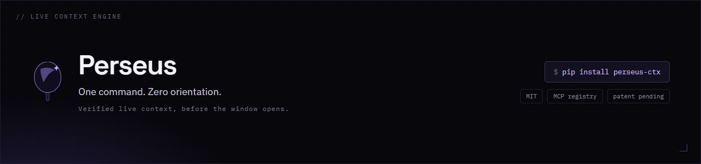

<div align="center">
  
</div>

# Perseus™ 🪞 — One command. Zero orientation.

[](https://github.com/Perseus-Computing-LLC/perseus/actions/workflows/test.yml)
[](https://pypi.org/project/perseus-ctx/)
[](https://pypi.org/project/perseus-ctx/)
[](https://github.com/Perseus-Computing-LLC/perseus/blob/main/LICENSE)
[](https://glama.ai/mcp/servers/Perseus-Computing-LLC/perseus)
[](https://getlulu.dev/mcps/perseus-faa880)

**Published on** [PyPI](https://pypi.org/project/perseus-ctx/) · [Official MCP Registry](https://registry.modelcontextprotocol.io/v0/servers?search=io.github.Perseus-Computing-LLC/perseus) · [Glama](https://glama.ai/mcp/servers/Perseus-Computing-LLC/perseus) · [Smithery](https://smithery.ai/servers/tcconnally/perseus) · [Lulu MCPs](https://getlulu.dev/mcps/perseus-faa880)
**`pip install perseus-ctx==1.0.26 && cd your-project && perseus quickstart`**

Zero to rendered context in three lines — no config spelunking:

```bash
pip install perseus-ctx==1.0.26                       # 1. install
cd your-project && perseus quickstart         # 2. scaffold .perseus/context.md + config
perseus render .perseus/context.md -o AGENTS.md   # 3. write live context your agent reads
```

`quickstart` detects your stack, scaffolds `.perseus/context.md`, writes config,
and verifies a render. Step 3 writes the file your assistant loads at session
start (`AGENTS.md`, `CLAUDE.md`, `.cursorrules`, ...). Keep it live with
`perseus watch` (or cron/systemd/launchd). Full walkthrough:
[Quickstart](https://github.com/Perseus-Computing-LLC/perseus/blob/main/docs/quickstart.md).

### What you get

- **Live context before the first turn** — render current workspace values with their source and freshness boundaries instead of making an assistant rediscover them.
- **One source, any assistant** — write `.perseus/context.md` once and render to `.hermes.md`, `AGENTS.md`, `CLAUDE.md`, `.cursorrules`, or another assistant context file.
- **Local-first by default** — the core renderer reads your workspace locally; no account or hosted service is required.
- **MCP-native when you need it** — expose the same live context as a stdio or SSE MCP server, with shell-executing tools opt-in.

### Context, memory, and session terms

Perseus resolves and shapes the active working context; Perseus Vault owns durable-memory persistence and recall.

- **Active working context** is the current, task-relevant workspace state — files, services, tasks, and other facts that can change. Perseus resolves and shapes it at render time before the assistant sees it.
- **Durable memory** is information intended to survive session boundaries. Perseus Vault owns its persistence and recall.
- **Recalled memory** is the subset of durable memory returned for a query and shaped into the rendered context. The public `@memory` directive remains the compatibility API name for Vault-backed recall; existing MCP compatibility names remain unchanged.
- **Session history** is Perseus's recent checkpoint and session-digest record. `@waypoint` and `@session` expose it; it is distinct from durable memory. An explicit capture may persist a checkpoint in Perseus Vault as durable memory.

### Fastest path

```bash
pip install perseus-ctx==1.0.26
cd your-project
perseus quickstart
```

That creates `.perseus/context.md` and a project config, detects common stacks,
and verifies the first render. See the [5-minute quickstart](https://github.com/Perseus-Computing-LLC/perseus/blob/main/docs/quickstart.md)
for assistant profiles, refresh options, and security settings.


[](https://github.com/Perseus-Computing-LLC/perseus/actions/workflows/test.yml)
[](https://pypi.org/project/perseus-ctx/)
[](https://registry.modelcontextprotocol.io/)
[](https://github.com/Perseus-Computing-LLC/perseus/blob/main/LICENSE)
[](https://github.com/Perseus-Computing-LLC/perseus/blob/main/docs/ip/README.md)
[**perseus.observer →**](https://perseus.observer)

**Perseus is the system around the model: current context, governed memory, and reviewable evidence for consequential agent work.**

Perseus Context Engine resolves live workspace state before execution. Perseus Vault carries selected, time-valid memory across sessions. Perseus Ledger records supplied events and evidence references for later review. The operator still chooses the model, keys, data path, deployment, and execution authority.

The latest company-run LongMemEval-S paired confirmation scored **410/500 (82.0%)** with the official-CoT answer prompt and evidence-structured candidate context, versus **416/500 (83.2%)** for the matched full-context control (**-1.2 points**). The preregistered success rule failed. This is not a superiority, independent-holdout, customer, deployment, or production-authorization claim. Read the [methods desk](https://perseus.observer/benchmarks/) and [canonical claim registry](claims.json) before reusing the number.

<!-- mcp-name: io.github.Perseus-Computing-LLC/perseus -->

---

## 🛡️ Platform

Perseus is one platform with three layers. Each layer has a distinct job; together they keep agent work oriented, durable, and reviewable.

| Layer | What it does | Page |
|---|---|---|
| **Perseus Context Engine** | Resolves configured workspace state into a bounded briefing with source and configuration boundaries before the model runs. | [perseus.observer/context-engine](https://perseus.observer/context-engine/) |
| **Perseus Vault** | Persists governed memory across sessions with local-first storage, retrieval, and confidence-aware records. | [perseus.observer/vault](https://perseus.observer/vault/) |
| **Perseus Ledger** | Records hash-chained events and evidence so consequential work can be reconstructed and reviewed. | [perseus.observer/ledger](https://perseus.observer/ledger/) |

The [benchmarks desk](https://perseus.observer/benchmarks/) is the proof surface for measured results. It is not a fourth product or a substitute for a customer evaluation.

---

### Perseus Vault — Persistent Memory (MCP)

[Perseus Vault](https://github.com/Perseus-Computing-LLC/perseus-vault) is the governed-memory component for Perseus. Its default local stdio path uses SQLite and FTS5 and does not require a Perseus-hosted service or API key. The release binary includes the default local embedding model. Optional connectors and network transports change that boundary and remain under operator configuration. Representative MCP tools include `perseus_vault_remember`, `perseus_vault_recall`, `perseus_vault_context`, `perseus_vault_traverse`, `perseus_vault_decay`, `perseus_vault_stats`, and `perseus_vault_health`.

📄 [Product page →](https://perseus.observer/vault/) | 📚 [Versioned MCP API reference →](https://perseus.observer/vault/mcp-reference/) | ⭐ [Vault on GitHub →](https://github.com/Perseus-Computing-LLC/perseus-vault)

**Install** (v2.23.2, x86_64 Linux; verified before extraction):
```bash
set -euo pipefail
workdir="$(mktemp -d)"
trap 'rm -rf "$workdir"' EXIT
archive="$workdir/perseus-vault-x86_64-unknown-linux-gnu.tar.gz"
curl -fSL -o "$archive" https://github.com/Perseus-Computing-LLC/perseus-vault/releases/download/v2.23.2/perseus-vault-x86_64-unknown-linux-gnu.tar.gz
printf '%s  %s\n' '7143709aa6c9c29128e5daae47c13ddcc6ec56b35c7a605726b51f635309998e' "$archive" | sha256sum -c -
tar -xzf "$archive" -C "$workdir"
test -f "$workdir/perseus-vault"
mkdir -p "$HOME/.local/bin"
install -m 0755 "$workdir/perseus-vault" "$HOME/.local/bin/perseus-vault"
```
Use the [v2.23.2 release page](https://github.com/Perseus-Computing-LLC/perseus-vault/releases/tag/v2.23.2) for macOS, Windows, other architectures, and provenance. Then run `perseus doctor` to confirm Perseus can reach it.

**Hermes Agent** — add to `~/.hermes/config.yaml`:
```yaml
mcp_servers:
  perseus_vault:
    command: "perseus-vault"
    args: ["serve"]
```

**Claude Desktop / Cursor** — add to your MCP settings:
```json
{
  "mcpServers": {
    "perseus_vault": {
      "command": "perseus-vault",
      "args": ["serve"]
    }
  }
}
```

**Perseus integration** — add to `.perseus/config.yaml`:
```yaml
perseus_vault:
  enabled: true
  command: ["perseus-vault", "serve"]
```
The `perseus-vault` binary self-resolves its canonical default DB path, so no `--db` argument is needed (its default is `~/.perseus-vault/data/perseus-vault.db`). The `perseus_vault:` configuration block is the sole supported memory configuration. Then add `@memory mode=search query="your terms"` to `.perseus/context.md` and Perseus resolves live recall at render time.

Works with any MCP-compatible assistant.

## Wire Perseus to Your Assistant (MCP)

Perseus implements the [Model Context Protocol](https://modelcontextprotocol.io/) (MCP), exposing tools over stdio or SSE transport. Most tools resolve workspace state when invoked, but freshness is tool-specific: the remote Perseus compatibility tool can cache results, waypoint data has a TTL, and explicit cache-enabled paths follow their configured policies.

> **Stable launcher for MCP and schedulers:** Use `~/.local/bin/perseus` in shell commands. In JSON/YAML MCP `command` fields, replace `~` with your home directory because exec-style clients do not perform shell expansion. This install-managed launcher stays stable across package upgrades instead of baking a version-specific Python or Library path into background configuration. Interactive shell commands may still use `perseus`; verify the resolved entry point with `command -v perseus` when diagnosing an installation.

> **⚠️ Security Gate:** Shell-executing directives (`@query`, `@agent`, `@services command:`) require `export PERSEUS_ALLOW_DANGEROUS=1`. Without it, shell directives are silently skipped.

### Quick Start (MCP Server)

```bash
pip install perseus-ctx==1.0.26
~/.local/bin/perseus mcp serve                          # stdio (Claude Desktop, Claude Code, Cursor, Codex)
```

For the loopback-only SSE listener, set a bearer token in the protected Perseus config before launch. The server binds to `127.0.0.1`, rejects non-loopback Host headers, and refuses an unauthenticated bind unless the operator explicitly overrides that safeguard. Multi-machine deployments need a separately reviewed authenticated proxy or tunnel:

```yaml
mcp:
  sse_bearer_token: "<secret from your secret manager>"
```

```bash
~/.local/bin/perseus mcp serve --transport sse --port 8420
```

### Assistant-Specific Wiring

Pick your assistant and add the config block shown:

**Hermes Agent** (`~/.hermes/config.yaml`):

```yaml
mcp_servers:
  perseus:
    command: /home/yourname/.local/bin/perseus
    args: ["mcp", "serve", "--workspace", "/path/to/workspace"]
```

Then verify with `hermes mcp test perseus`. Tools appear as `mcp_perseus_*` in your session.

> Use an absolute path for `--workspace`. Perseus's non-interactive shell context has a limited PATH, so the stable launcher above avoids relying on interactive-shell lookup.

**Claude Desktop** (`claude_desktop_config.json`):

```json
{
  "mcpServers": {
    "perseus": {
      "command": "/Users/yourname/.local/bin/perseus",
      "args": ["mcp", "serve", "--workspace", "/path/to/workspace"]
    }
  }
}
```

**Claude Code** (`.mcp.json` in your project root):

```json
{
  "mcpServers": {
    "perseus": {
      "command": "/Users/yourname/.local/bin/perseus",
      "args": ["mcp", "serve"]
    }
  }
}
```

**Cursor** (`.cursor/mcp.json`):

```json
{
  "mcpServers": {
    "perseus": {
      "command": "/Users/yourname/.local/bin/perseus",
      "args": ["mcp", "serve"]
    }
  }
}
```

**Codex** (`~/.codex/config.toml` or per-project `.mcp.json`):

```json
{
  "mcpServers": {
    "perseus": {
      "command": "/Users/yourname/.local/bin/perseus",
      "args": ["mcp", "serve"]
    }
  }
}
```

**Rovo Dev** (`.mcp.json` in repo root):

```json
{
  "mcpServers": {
    "perseus": {
      "command": "/Users/yourname/.local/bin/perseus",
      "args": ["mcp", "serve"]
    }
  }
}
```

Rovo Dev also reads `AGENTS.md` at session start — pair MCP tools with rendered context for a complete setup.

### Docker

```bash
docker build -t perseus .
docker run --rm -v /path/to/workspace:/workspace perseus mcp serve
```

See [Container Runtime](https://github.com/Perseus-Computing-LLC/perseus/blob/main/docs/CONTAINER.md) for full Docker and compose deployment.

### MCP Registry

Published as [`io.github.Perseus-Computing-LLC/perseus`](https://registry.modelcontextprotocol.io/) on the official MCP Registry (search \"perseus\"). Includes `server.json` for zero-config discovery.

---

### Current MCP interface

<!-- test-count: 2818 — recount with: grep -rE "^\s*def test_" tests/ | wc -l -->

Perseus Context Engine exposes workspace-context operations over MCP. The current public interface centers on rendering and inspecting context, checking health, reading explicitly allowed workspace sources, and connecting to Perseus Vault for durable memory. Code-level compatibility identifiers are not separate Perseus products.

Sensitive operations that execute a shell command or local agent process are excluded from the default tool set. They require an explicit `mcp.tool_allowlist` entry and the applicable dangerous-operation gate. They run with the current user's permissions and are not sandboxed.

Use the [technical setup guide](SETUP-GUIDE.md) for host configuration. The [Context Engine MCP compatibility reference](docs/context-engine-mcp-tools.md) isolates code-level identifiers from the public product summary. Use the [versioned Perseus Vault MCP reference](https://perseus.observer/vault/mcp-reference/) for the release-bound Vault tool surface.

---

## The Problem

Every AI assistant session starts cold. Before useful work begins, the assistant burns turns on orientation — checking which services are running, reading stale config files, rediscovering where you left off. Static markdown files (`.cursorrules`, `CLAUDE.md`) rot immediately. The port you wrote down has changed. The container that was "always running" hasn't been started since Tuesday.

**Stale context isn't neutral. It's drag.**

---

## The Fix: Resolve Before Context

Perseus is a pre-processor. You write directives in a source document — `@query`, `@services`, `@waypoint` — and Perseus resolves them at render time, then outputs plain markdown. The assistant receives the rendered values together with the source and configuration boundaries that produced them.

```
Without Perseus                     With Perseus
────────────────────────────────    ──────────────────────────────────
"Port is 3001 (check .env)"    →   Port: 3001
"47 tests (may be stale)"      →   Tests: all passing (run 8s ago)
"Check docker ps first"        →   mongo-dev: Up 4h 12m
"Where did we leave off?"      →   Checkpoint: webhook handler written,
                                              pending test run
```

Perseus replaces your assistant's context file — `CLAUDE.md`, `.cursorrules`, `AGENTS.md`, `.hermes.md` — with rendered live context. **If you already have a hand-written context file, migrate its static content into `.perseus/context.md` first.** Perseus overwrites the output file on every render. Add `@perseus` to line 1 of your source and it becomes live. The assistant never sees directive syntax. It sees a rendered snapshot whose freshness depends on the source, configuration, and runtime availability.

---

## Quick Start (30 Seconds to Live Context)

```bash
perseus quickstart          # auto-detects project, scaffolds context, renders
```

Smart init detects your stack and tailors the setup:
- **Python** → `@memory` queries for test patterns, type annotations
- **Rust** → trait bounds, lifetime annotations, cargo config
- **Node.js/TS** → npm scripts, ESLint config, component patterns
- **Go, Java, C/C++, Docker** — all detected automatically
- Falls back to a sensible generic query when unknown

The output file name is the only assistant-specific detail:

| Assistant | Output file |
|---|---|
| Claude Code | `CLAUDE.md` |
| Hermes Agent | `.hermes.md` (top priority) or `AGENTS.md` |
| Cursor | `.cursorrules` or `.cursor/context.md` |
| Codex | `AGENTS.md` |
| Rovo Dev | `AGENTS.md` |
| Any other | Whatever your assistant reads at session start |

> **Hermes priority order:** `.hermes.md` → `AGENTS.md` → `CLAUDE.md`. Render to `.hermes.md` for highest priority.

Keep it fresh with cron, launchd, systemd, or `perseus watch`:

```bash
# Linux systemd (auto-refresh every 5 minutes)
~/.local/bin/perseus systemd create .perseus/context.md --output AGENTS.md --interval 5m --install --enable

# macOS launchd
~/.local/bin/perseus launchd create .perseus/context.md --output AGENTS.md

# Cron (any POSIX host)
~/.local/bin/perseus cron create .perseus/context.md --output AGENTS.md --every 5 --install
```

See the [file-based Hermes integration guide](https://github.com/Perseus-Computing-LLC/perseus/blob/main/docs/HERMES_INTEGRATION.md) for generated context-file setup and [adapter patterns](https://github.com/Perseus-Computing-LLC/perseus/blob/main/spec/integration.md) for full integration details.

---

## Why Perseus? (Proof, Hardening, and Enterprise Value)

Perseus delivers context rendered from configured sources, with freshness limits made visible, so AI assistants spend fewer turns orienting themselves. Here's how it stands up:

### Performance & efficiency

Current public measurements belong in the [methods desk](https://perseus.observer/benchmarks/) and [claims registry](claims.json). Each reusable figure must keep its method, dataset, denominator, control, and limitation attached.

### Reliability & Security

Perseus is tested against edge cases that challenge the resolve-before-context contract. The current security boundary and documented posture live in [SECURITY.md](SECURITY.md) and on the [public security page](https://perseus.observer/security/):

- **MCP SSE bearer-token auth** — `POST /message` requires Bearer token via `mcp.sse_bearer_token` config key (falls back to `serve.auth_token` for backward compat). Unauthenticated requests receive 401.
- **Platform-portable MCP timeout** — `_call_tool()` uses `ThreadPoolExecutor` + `Future.result(timeout=...)` instead of Unix-only SIGALRM. Works on Windows, macOS, and Linux.

**Platform support:** Perseus is developed and CI-tested on Linux. macOS is supported but not in CI. Windows core rendering, MCP transport, and Task Scheduler integration work with known POSIX-specific shell, path, and LSP caveats.
- **Foreign resolver SSRF protection** — URL allowlist via `foreign_resolver.url_allowlist`, private-IP blocking (`block_private_ips`, default true), HMAC signature verification (`verify_signatures` now defaults to true, minimum 32-char secret). Redirects re-check destination IPs. Localhost (127.0.0.1, ::1) explicitly allowed for local testing.

- **Workspace boundaries** — Symlink escapes (direct, relative, chained, to `/etc`) are all blocked. The trust-gate resolves symlinks to their real target before checking boundaries.
- **Context overflow protection** — `@read` and `@include` warn and truncate when files exceed `max_read_bytes` / `max_include_bytes` (512 KB default, `None` for unlimited).
- **Transitive resolution** — `@include` on `.md` files recursively renders directives up to `max_include_depth` (default 5), with cycle detection.
- **Integrity drift** — Optional `integrity_check` captures file mtimes before render and warns if any file changed mid-resolution.
- **Plugin permission gating** — Plugin directives with `executes_shell=True` are gated behind `allow_query_shell`, like built-ins. This is a permission gate, not a sandbox: enabled plugin code runs with the current user's permissions. Plugin errors are caught and surfaced as inline warnings.

[Edge-case tests](tests/test_edge_cases.py) cover circular dependencies, race conditions, symlink escapes, and context overflow. These four config knobs live under `render:` in `~/.perseus/config.yaml`.

Perseus reads from a live filesystem — there is no snapshot isolation unless you enable `integrity_check`. Files can change between directive resolutions. The render output reflects whatever was on disk at the moment each directive resolved, **not** a single atomic point-in-time. This is the documented tradeoff for a local pre-processor (low overhead by default, check when it matters), but it is not a database transaction.

The `O_CREAT | O_EXCL` checkpoint locking is atomic on local POSIX filesystems. Network filesystems (**NFS** < v4, **SMB**, cloud mounts) may not honor these semantics — if you run a multi-agent relay across machines, use a local disk or a filesystem with verified atomic-create support.

`perseus.py` is a compiled build artifact produced by `scripts/build.py` from the modular `src/perseus/` tree. It is not hand-maintained as a single file. The source modules are the canonical form.

---

## Research references

The architecture draws on published work about context contracts, governed selection, structured context, and protocol security. Those papers motivate design questions; they do not validate Perseus products or supply reusable Perseus benchmark claims.

- [Protocol-Driven Development](https://arxiv.org/abs/2605.12981)
- [ContextNest](https://arxiv.org/abs/2607.02116)
- [HiSkill](https://arxiv.org/abs/2607.25853)
- [Breaking the Protocol](https://arxiv.org/abs/2601.17549)

Use the [public methods desk](https://perseus.observer/benchmarks/) and [`claims.json`](claims.json) for current Perseus measurements, controls, denominators, and limitations.

---

## How Perseus Works

The first line in this **illustrative syntax sample** is the directive protocol marker, not the installed package version. Dates, task names, and rendered values below are examples, not current release or test evidence:

```markdown
@perseus v1.0.8

# Context — @date format="YYYY-MM-DD HH:mm z"

## What's Running
@query "docker ps --format 'table {{.Names}}\t{{.Status}}'"

## Last Session
@waypoint ttl=86400

## Ports
@read .env key="API_PORT" fallback="3001"

## Active Tasks
@agora status=open,in_progress

## Skills Available
@skills flag_stale=true category=devops,github

## Project Memory
@memory focus="recent"
```

Perseus renders this:

```markdown
# Context — 2026-05-27 08:33 CDT

## What's Running
mongo-dev    Up 4 hours
redis-dev    Up 4 hours

## Last Session
Checkpoint written: 2026-05-27T08:28
Task: webhook handler — written, pending test run
Next: run pytest tests/test_webhook.py

## Ports
3001

## Active Tasks
| ID | Title | Status | Scope |
|---|---|---|---|
| task-08 | List and Tree Directives | Complete | medium |
| task-12 | Perseus Vault Narrative Memory | Complete | large |

## Skills Available
| Skill | Category | Updated |
|---|---|---|
| hermes-agent | autonomous-ai-agents | 2026-05-20 |
| github-pr-workflow | github | 2026-05-15 |
| docker-stack-auditing ⚠ | devops | 2026-03-01 |
| documentation-audit | software-development | 2026-05-26 |

## Project Memory
### Recent
- [Illustrative] Reviewed a retry classification and shell-input hardening change.
- [Illustrative] Added an MCP integration path for a project workspace.
- [Illustrative] Published an earlier package release.
- [Illustrative] Added plugin directives, macros, hooks, and pipes.
```

The assistant never sees a directive. It sees a rendered snapshot of which skills are available, which tasks are open, and what decisions were recently made; those values should be checked against their source and freshness limits.

### Extensibility in Practice

Macros reduce repetition. Pipes compose. Aliases keep things short:

```markdown
@macro health-check %service%
@query "curl -s http://%service%:8080/health"
@services
  - name: %service%
    url: http://%service%:8080/health
@endmacro

@q "git log --oneline -5" | @cache ttl=300
@health-check my-api
```

The assistant sees resolved output — never a directive.

Full directive reference: [`docs/DIRECTIVES.md`](./docs/DIRECTIVES.md).

---

## Session Waypoints

If an agent session crashes or a connection drops, Waypoints preserve the execution state.

```bash
perseus checkpoint \
  --task "Implementing webhook integration" \
  --status "handler written, pending test run" \
  --next "run pytest tests/test_webhook.py" \
  --workspace /workspace/myproject
```

The next session recovers immediately with `perseus recover` — workspace-aware, freshness-gated, no re-orientation.

---

## Composition boundary

Perseus Context Engine writes bounded context artifacts and workspace checkpoints. Other systems can read those files to coordinate work, but the Context Engine is not an orchestration platform and the repository does not claim an enterprise deployment from that composition pattern.

---

## Architecture

```text
operator-authored context source
        |
        v
Perseus Context Engine
  - validates enabled directives
  - resolves allowed local sources
  - gates optional shell and network operations
  - emits bounded markdown plus diagnostics
        |
        +--> compatible assistant host
        +--> optional Perseus Vault recall
        +--> optional Perseus Ledger evidence record
```

Perseus Vault and Perseus Ledger remain separate components. Extensions, hooks, custom directives, and external service checks execute only when the operator configures them; they inherit the current user's permissions and can change the local-only data boundary.

### Tiered Context (Progressive Disclosure)

Not every question needs the full environment injected. A "what's 2+2?" shouldn't pull in Docker health checks, skill listings, and session digests. Perseus now ships tiered context rendering — the agent *is* the RAG.

```bash
perseus render .perseus/context.md --tier 1    # core context (~12 directives, lean)
perseus render .perseus/context.md --tier 2    # + services, skills, sessions
perseus render .perseus/context.md              # everything (backward compatible)
```

Three tiers, assigned per directive in the registry:

| Tier | Name | What goes here |
|------|------|---------------|
| **1** | Always | Core context — lightweight, always needed (`@date`, `@memory`, `@waypoint`, `@health`, `@env`) |
| **2** | Conditional | Task-specific, heavier (`@services`, `@skills`, `@session`, `@agora`, `@inbox`) |
| **3** | On-Demand | Bulky/expensive — the agent pulls it if needed (`@query`, `@read`, `@include`, `@tree`, `@list`) |

Directives above the tier limit are skipped and reported in a **Context Manifest**:

```
> 📋 Context Manifest — Tier limit: 1
>
> • @services (Tier 2 / Conditional) — Health-check listed services
> • @skills (Tier 2 / Conditional) — List available skills
> • @query (Tier 3 / On-Demand) — Run a shell command and embed stdout
>
> Re-run with `perseus render --tier 2` for conditional context,
> or `--tier 3` for full context on demand.
```

Template authors can override per-instance with `@tier:N`:

```markdown
@services @tier:1    # Always resolve this block, even though @services defaults to Tier 2
docker
nginx
@end
```

Set `render.default_tier: 1` in `~/.perseus/config.yaml` to make lean context the default for all renders. No embedding model, no LLM routing — one integer comparison per directive gates resolution. The agent sees what's available and can pull it on demand.

### Prompt-Size Forensics (`perseus prompt-size` + `@budget`)

Context is the scarcest resource in agent systems — and it's usually spent blind. `perseus prompt-size` renders a context and shows exactly where every byte went, attributed **per directive**, with a static-vs-dynamic split:

```bash
perseus prompt-size .perseus/context.md          # human table, largest offenders first
perseus prompt-size .perseus/context.md --json   # stable, deterministic JSON for CI diffing
perseus prompt-size .perseus/context.md --since HEAD~5   # per-directive budget delta vs a git ref
```

```
perseus prompt-size: context.md (tier 3)
total: 5950 bytes, 2270 tokens [tiktoken:cl100k_base — exact]
split: static 43 B / cacheable 45 B / volatile 5862 B (attributed 5907 + static 43 = 5950 — exact)

Per directive (largest first):
      5862 B     2249 tok   98.52%  [ volatile]  @env PATH  line 7
        45 B        9 tok    0.76%  [cacheable]  @include "sub.md"  line 8
```

- **Byte-exact accounting** — per-directive bytes + static template bytes sum to the rendered total with no unattributed remainder (the `accounting.exact` field asserts this in `--json`).
- **Tokenizer-aware** — real BPE counts via `tiktoken` (cl100k_base) when it happens to be installed (labeled `exact`); otherwise a deterministic offline heuristic clearly labeled `estimate`. Never a network call.
- **Static vs. dynamic split** — see how much of the render is a cacheable prefix vs. per-render volatility (`@env`, `@date`, `@query`).
- **`--since <git-ref>` diff mode** — renders the file's content at the ref (via `git show`, offline) and reports which directive's contribution grew, so "someone added an `@include` that doubled the prompt" is caught in review.

Pair it with a **`@budget`** declaration in the source to gate context bloat in CI:

```markdown
@perseus
@budget max=8000 strict forensic
...
```

`perseus prompt-size` checks every `@budget` after the render: under budget passes silently; over budget warns with the per-directive offender breakdown — or exits non-zero when the declaration says `strict` (or the CLI is invoked with `--strict`). `forensic` expands the overflow report to the full per-directive table plus the static/cacheable/volatile split. The directive itself renders as empty text, so it costs nothing in the context it guards.

Scope contract: `@budget` declarations are read from the top-level source text before conditionals are evaluated — **top-level only**. A `@budget` inside an `@include`'d file is not enforced (`prompt-size` warns and reports it under `included_budgets` in `--json`); a `@budget` inside a false `@if` branch is still enforced, because the scan is text-level. In `--json` output, `static.tokens` is derived (total − Σ per-directive tokens, clamped at 0 and flagged `tokens_derived`) — the byte accounting is the measured, exact invariant.

### Directive Aliases

Config-driven shorthand — single-pass, no recursive expansion:

```yaml
# ~/.perseus/config.yaml
directives:
  aliases:
    "@q": "@query"
    "@svc": "@services"
    "@stale-skills": "@skills flag_stale=true category=all"
```

Pre-defined aliases: `@q→@query`, `@r→@read`, `@svc→@services`, `@mb→@memory`,
`@ag→@agora`, `@wp→@waypoint`, `@sess→@session`. Config aliases override them.

### Custom Schema Validators

Plugin validators for domain-specific schemas:

```markdown
@query "cat endpoints.yaml" schema="plugin:endpoint_list"
```

Validator modules in `~/.perseus/validators/` export a `validate(value, schema_def)`
function returning `(valid: bool, message: str)`.

### Event Webhooks

POST render lifecycle events to an external URL with optional HMAC-SHA256 signing:

```yaml
webhooks:
  enabled: true
  url: "https://hooks.example.com/perseus-events"
  secret: "your-hmac-key"
  events:
    - on_render_start
    - on_render_complete
    - on_directive_error
```

### Speculative Prefetch (`@speculate`)

Speculative execution for context assembly (#607): a transparent Markov /
frequency predictor over your recorded waypoint (checkpoint) transitions
predicts the next task, and Perseus pre-warms that task's context **after the
current render completes** — so the first render of the next turn is already
hot. No ML dependencies; the predictor interface is pluggable for a future
LLM backend.

**Off by default.** Enable it in config and opt a source in with the pragma:

```yaml
# ~/.perseus/config.yaml
speculate:
  enabled: true              # master gate — default false (zero behavior change)
  k: 3                       # top-k predicted next intents to consider
  budget_tokens: 2000        # cumulative token budget per speculation pass
  confidence_threshold: 0.30 # only warm predictions at/above this probability
  intents:                   # intent pattern (fnmatch) → prefetch directive line(s)
    "deploy*":
      - '@read "runbook.md" @cache ttl=300'
    "review*":
      - '@query "git log --oneline -10" @cache ttl=120'
```

```markdown
@perseus v1

Your context here...
@speculate k=3 budget=2000
```

The `@speculate` pragma never appears in rendered output; `k=` / `budget=`
override the config for that source. Speculation is synchronous-after-render:
it can never delay or interleave with the live render, and a failure inside
speculation never breaks a render.

**Cache safety:** speculative warms run through the same prefetch executor and
use the exact key derivation the renderer reads (workspace-scoped base key +
dependency fingerprint), so a speculative entry is just an *early* warm — it
can never shadow or poison real reads. On the real turn the renderer
re-derives the fingerprint and TTL as usual, so a wrong prediction costs
nothing.

**Observability:**

```console
$ perseus explain --speculate
Speculate: enabled=true backend=markov k=3 threshold=0.30
History: 42 intent(s); current: review PR
Predicted next intents:
  1. deploy staging  p=0.67  [1 candidate(s), 1 warm]
     - warm: @read "runbook.md" @cache ttl=300
Past speculation: hits=12 misses=4 hit_rate=0.75 (settled=16)
```

Prediction outcomes (hit/miss per settled prediction, budget spend, warm
results) persist to a workspace-keyed stats file
(`<cache_dir>/speculate_stats-<workspace_hash>.json`, atomic writes) with a
documented shape — a future `@bandit` ledger integration can consume it as a
value signal.

---

## Context profiles and durable-memory boundary

Perseus Context Engine resolves and shapes the active working context. Perseus Vault owns durable-memory persistence and recall. The default `on_demand` profile adds a retrieval pointer instead of preloading a memory dump; `relevant` and legacy `always` modes require explicit configuration.

```yaml
profiles:
  default: { context_target: 200000, memory: on_demand }
```

An explicit `@memory` directive is a code-level compatibility interface for requesting recalled memory. It is not a separate product. Recalled material can be stale or incomplete, so live workspace state and operator policy remain authoritative.

To disable automatic recall pointers, set `perseus_vault.auto_inject: false`. See the [setup guide](SETUP-GUIDE.md) and the [versioned Vault API reference](https://perseus.observer/vault/mcp-reference/) for the current boundary.

---

## Full Documentation

| Document | What it covers |
|---|---|
| [**CLI Reference**](./docs/CLI.md) | Every command and flag |
| [**Setup & Config Guide**](./SETUP-GUIDE.md) | The definitive setup, config, automation, and troubleshooting guide |
| [**Directives Reference**](./docs/DIRECTIVES.md) | All directives with modifiers and examples |
| [**File-based Hermes integration**](./docs/HERMES_INTEGRATION.md) | Generate context files for Hermes |
| [**Adapter Patterns**](./spec/integration.md) | Wire Perseus to any AI assistant |
| [**Container Runtime**](./docs/CONTAINER.md) | Docker and compose deployment |
| [**Quickstart**](./docs/quickstart.md) | 5-minute setup walkthrough |
| [**Product Contract**](./docs/PRODUCT_CONTRACT.md) | Guarantees, trust model, permissions |
| [**Contributing**](./docs/CONTRIBUTING.md) | Dev setup, test suite, commit conventions |
| [**Examples**](./docs/EXAMPLES.md) | End-to-end workflow recipes |
| [**Use Cases**](./docs/use-cases.md) | Real-world usage patterns |
| [**Performance**](./docs/PERFORMANCE.md) | Benchmark methodology and results |
| [**Agent Surfaces**](./docs/AGENT_SURFACES.md) | JSON contracts for agent consumption |
| [**Deployment**](./docs/DEPLOYMENT.md) | Current deployment guidance with pinned versions |
| [**Security**](./SECURITY.md) | Trust model, workspace boundaries, secrets |
| [**Roadmap**](./ROADMAP.md) | Living roadmap (live `@perseus` source) |

---

## Defense and Government

Perseus Computing LLC can contribute current context, governed memory, and reviewable evidence around a prime-led or program-owned workflow. It does not replace the mission system, qualified integrator, approving authority, or accreditation process.

| Record | Current public scope |
|---|---|
| **Company identifiers** | UEI `PJS2LW7HAK35`; CAGE `22JC5`. Verify current SAM status before proposal, subcontract, or award use. |
| **Assessment evidence** | Owner-held NIST SP 800-171 Basic and CMMC Level 2 self-assessments scored 110 for their recorded enclave scope. These are company self-assessments, not independent assessments or C3PAO certification. |
| **JCP / DD2345** | Certification `0092893`, approved 2026-08-18 through 2031-08-18, supports requests for unclassified export-controlled military technical data. It does not grant data access, classified access, facility clearance, an ATO, or cross-domain approval. |
| **Software publication** | MIT-licensed source, SBOM, and security materials are published. Publication does not create Government approval or accreditation. |
| **Deployment boundary** | Local CLI and stdio paths do not require a Perseus-hosted service. A program or integrator remains responsible for packaging, hardening, keys, networks, data handling, testing, and authorization. |

Review the bounded [Defense and Government page](https://perseus.observer/government/) or contact **Perseus Computing LLC** at [perseus@perseus.observer](mailto:perseus@perseus.observer).

---

## IP & Legal

**Patent Pending.** A provisional patent application covering Perseus's
resolve-before-context pipeline architecture is on file with the USPTO.
See **[docs/ip/](docs/ip/)** for the public IP portfolio, including
technical disclosures and evidence exhibits.

**PERSEUS™** identifies software published by Perseus Computing LLC. Internal subsystem names are compatibility identifiers, not separate public product lines.

## Privacy Policy

Perseus Context Engine has a local default render path. Authored network directives, optional transports, and external integrations change that boundary.

### Data Collection
- The default local renderer does not send Perseus telemetry or require a Perseus-hosted service.
- Operators choose the sources, output paths, network directives, and integrations they enable.

### Data Usage & Storage
- Perseus reads project files, git state, and environment variables to resolve context directives.
- On the default local path, project data remains in the operator environment. Authored HTTP directives or external integrations can send operator-selected data to their configured destination.
- When paired with Perseus Vault for persistent memory, memory data is stored locally per the Perseus Vault privacy policy.

### Third-Party Sharing
- The local default path does not share project data with Perseus Computing LLC.
- Optional MCP servers, HTTP directives, package registries, and other external services apply their own data and transport policies when the operator enables them.

### Data Retention
- Perseus does not retain data independently. Rendered context is ephemeral and regenerated on each invocation.
- For persistent memory, see [Perseus Vault's privacy policy](https://github.com/Perseus-Computing-LLC/perseus-vault#privacy-policy).

### Contact
- **Email:** perseus@perseus.observer
- **GitHub:** [Perseus-Computing-LLC/perseus](https://github.com/Perseus-Computing-LLC/perseus)

## License

**License:** MIT — see [LICENSE](./LICENSE). This license does not include
a patent grant; patent rights are reserved separately.

**Third-party notices:** see [NOTICE](./NOTICE).
