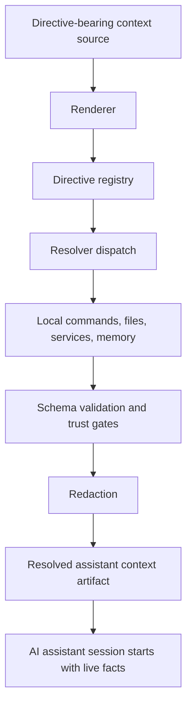
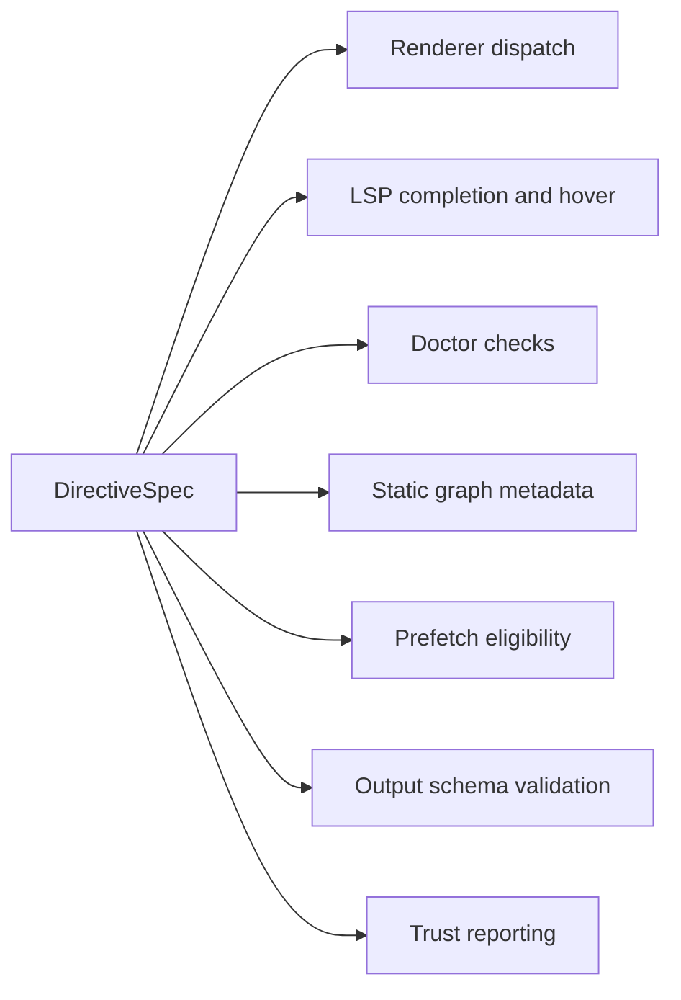
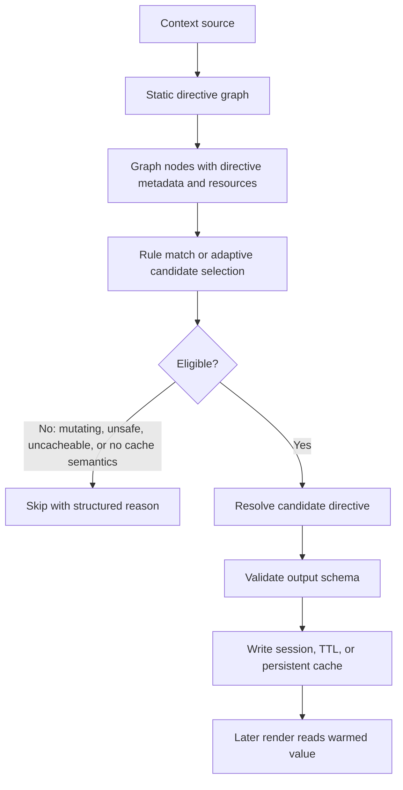
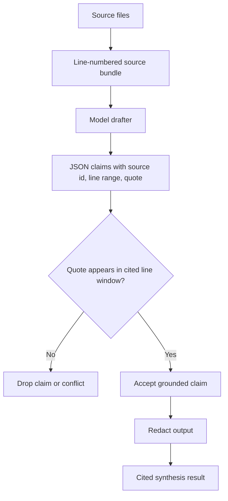
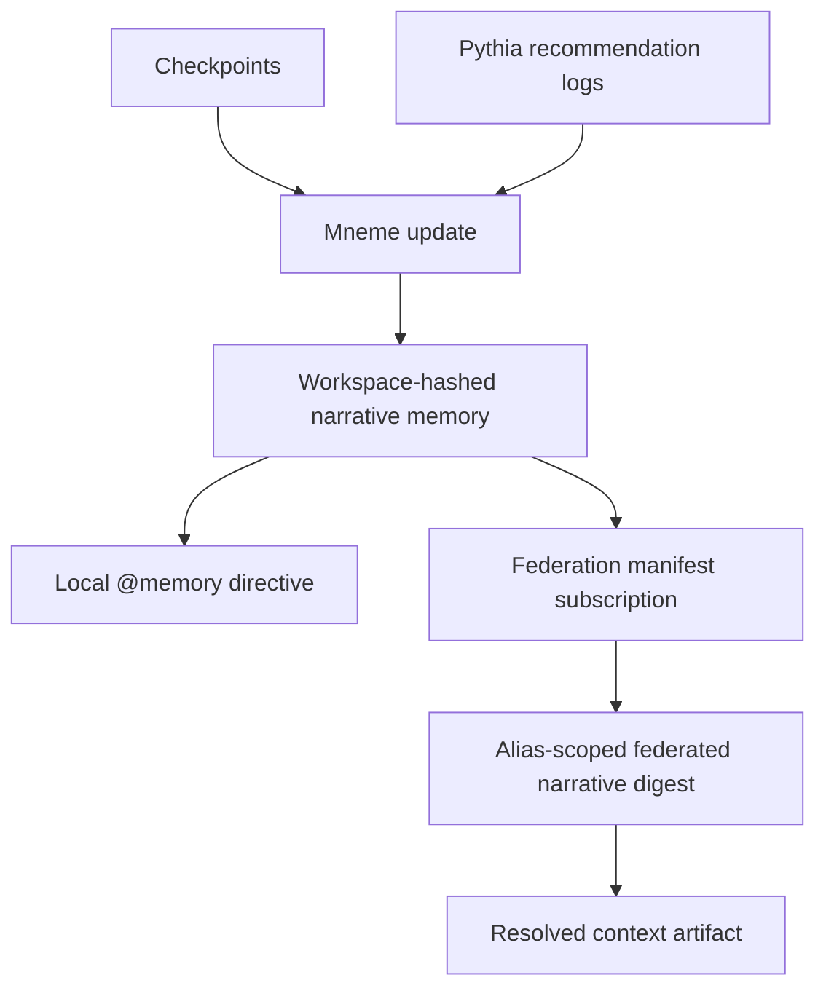
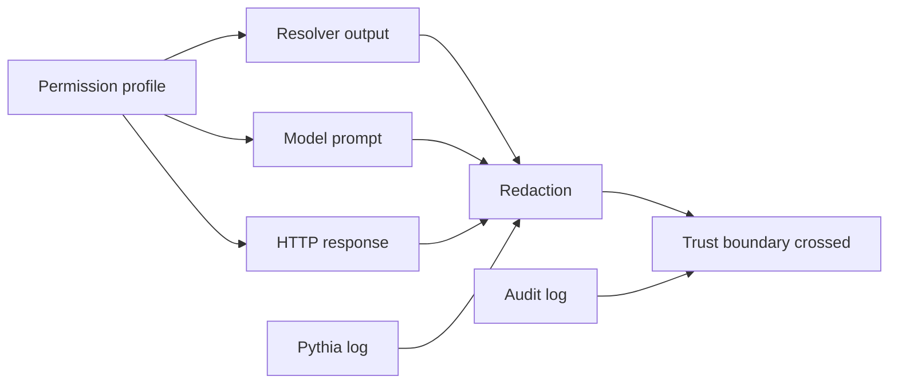

# Draft Figures

These are private draft figures for later patent drafting. They use Mermaid so
they can be rendered into drawings later.

## Figure 1: Resolve-Before-Context Pipeline

Narrative: A source document containing directives is resolved before an
assistant receives it. The assistant receives a completed context artifact
rather than instructions to discover state.

## Figure 2: Directive Registry Metadata

Narrative: A single directive specification defines callable behavior, argument
surface, safety flags, cacheability, and schema constraints. The same metadata
is reused across runtime and tooling surfaces.

## Figure 3: Static Graph and Trust-Gated Prefetch

Narrative: Prefetch execution is based on a static representation of the context
source and registry-driven safety metadata. The system warms only authorized
cache entries.

## Figure 4: Cited Synthesis Gate

Narrative: The model is not treated as an authority. Generated claims survive
only if the cited quote exists in the cited source lines.

## Figure 5: Workspace Memory and Federation

Narrative: Per-workspace memory is generated from checkpoints and recommendation
logs, then optionally exposed to other workspaces through narrative-only
subscriptions.

## Figure 6: Trust Boundary Surfaces

Narrative: Permission profiles, redaction, and audit logging operate at the
boundaries where local data may leave the resolver and enter assistant-visible
or externally visible surfaces.
